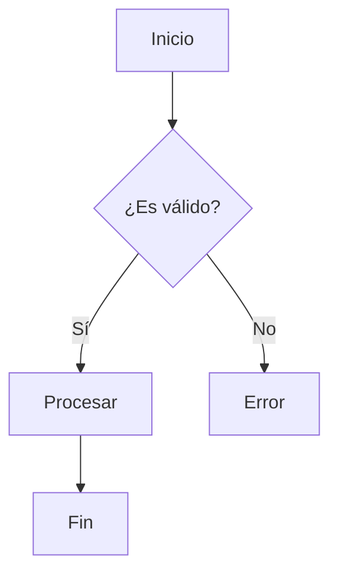

# Soyio Voice & Style Guide

## Above all, simple and human
Nuestra documentación debe ser clara, cercana y enfocada en el lector. Lo más importante no es solo **qué decimos**, sino **cómo lo decimos**.

## Voice
La voz de Soyio es la forma en que hablamos con las personas. Es una mezcla de **personalidad, tono, estilo y sustancia**.

- La **voz** es constante: siempre cercana, clara y útil.
- El **tono** cambia según el contexto: puede ser serio, empático, o ligero (cuando celebramos un logro).


## Nuestros 3 principios de voz

### Warm and relaxed
Naturales, menos formales, con lenguaje cotidiano. Cercanos, sin rigidez. A veces divertidos, cuando corresponde.

### Crisp and clear
Directos y fáciles de escanear. Menos es más. Primero escaneo, después lectura.

### Ready to lend a hand
Estamos del lado del usuario. Anticipamos dudas y ofrecemos la información precisa, en el momento justo.

## Estilo centrado en el lector
Hablar con el cliente de forma cálida, clara y útil refuerza nuestro compromiso: **dar poder a las personas para lograr más con menos fricción**.

## Writing Style Tips

### Ve al grano
Empieza con lo más importante. Haz visibles las decisiones y próximos pasos.

**Ejemplo**
❌: Si deseas crear una integración, primero debes acceder a la consola de administración.
✅: Crea tu integración desde la consola de administración.


### Habla como persona
Lenguaje conversacional, optimista. Palabras simples y frases cortas.

**Ejemplo**
❌ Invalid ID
✅ Necesitas un ID con este formato: `alguien@ejemplo.com`

### Simplicidad ante todo

Divide, resume, corta palabras innecesarias.

**Ejemplo**
❌: El comando Recommended Charts recomienda gráficos que probablemente representen tus datos de manera efectiva.
✅: Usa Recommended Charts para crear el gráfico que mejor se adapte a tus datos.

### Capitalización

Usa sentence case: solo la primera palabra y nombres propios.
Nunca uses Title Case.

**Ejemplo**
❌ Encuentra Un Socio De Soyio
✅ Encuentra un socio de Soyio

### Puntuación ligera

- No uses puntos finales en títulos, subtítulos ni listas cortas.
- Un solo espacio después de punto.

### Verbos fuertes

Comienza con acción. Elimina “puedes”, “hay”, “existen”.

**Ejemplo**
❌ Puedes almacenar archivos en la nube.
✅ Almacena tus archivos en la nube.

### Usa Vínculos Referenciales

Cuando menciones un concepto que se detalla en otra sección, agrega un vínculo a esa página. Esto ayuda a los usuarios a profundizar cuando lo necesitan y nos permite evitar repetir información. Una breve explicación seguida del enlace es la mejor práctica.

**Ejemplo**
❌: Para autenticarte, mira la sección de autenticación.
✅: El primer paso es autenticar tu solicitud usando una API Key. Puedes aprender a generar y usar tu clave en nuestra [guía de autenticación](../api/authentication.mdx).

### Divide Tareas Complejas
Desglosa procesos largos o de varios pasos en partes más pequeñas y manejables. Esto se conoce como "progressive disclosure". Ayuda a los usuarios a enfocarse en una acción a la vez, evitando que se sientan abrumados. Usa listas numeradas o subtítulos para guiar al usuario a través de la secuencia.

**Ejemplo**

❌ **Mal:**
Para configurar un webhook, ve a la sección 'Desarrolladores', haz clic en 'Crear Webhook', ingresa la URL de tu endpoint (debe ser HTTPS), selecciona los eventos que quieres escuchar como `agreement.created`, y luego guarda. Recibirás un secreto de firma que debes usar para verificar las cargas útiles que te enviamos.

✅ **Bien:**
Sigue estos pasos para configurar tu webhook:
1.  **Ve a la sección de Webhooks:** En tu dashboard, navega a `Desarrolladores > Webhooks`.
2.  **Crea un nuevo Webhook:** Haz clic en "Crear Webhook".
3.  **Configura tu endpoint:** Ingresa tu URL `HTTPS` y selecciona los eventos que deseas escuchar (ej. `agreement.created`).
4.  **Guarda y asegura tu endpoint:** Al guardar, recibirás un secreto de firma. Úsalo para [verificar las firmas de los webhooks](./webhooks.md#verifying-signatures) en cada solicitud que recibas.

### Usa Imágenes para Aportar Claridad
Una imagen puede valer más que mil palabras, especialmente al explicar interfaces de usuario o flujos complejos.

- **Añade capturas de pantalla** para guiar a los usuarios a través de pasos en la interfaz gráfica.
- **Si no tienes la imagen final**, usa un placeholder descriptivo en el texto para que no se nos olvide añadirla.

**Ejemplo de placeholder:**
`[placeholder: Captura de pantalla del formulario de creación de webhooks con los campos resaltados]`

### Proporciona Ejemplos Relevantes
Los ejemplos abstractos son difíciles de entender. Basa tus ejemplos en casos de uso reales que nuestros usuarios enfrentarían al utilizar un módulo o funcionalidad.

**Ejemplo**

Contexto: Documentando un endpoint `POST /agreements`.

❌ **Mal:**
Puedes crear un acuerdo enviando un `POST` con un `title` y un `content`.
```json
{
  "title": "Título de prueba",
  "content": "Contenido de prueba."
}
```

✅ **Bien:**
Para registrar el consentimiento de un usuario a tus Términos y Condiciones, puedes crear un acuerdo. El `title` debe ser claro y el `content` puede ser el texto legal completo.
```json
{
  "title": "Aceptación de Términos y Condiciones v1.2",
  "content": "El usuario acepta los términos y condiciones descritos en..."
}
```


## Reglas rápidas de estilo
1. Ideas grandes, pocas palabras.
2. Escribe como hablas.
3. Sé amable, usa contracciones (estás, somos).
4. Empieza con lo más importante.
5. Breve = mejor.
6. Usa sentence case.
7. Evita puntos innecesarios.
8. Un espacio después del punto.
9. Edita lo débil: empieza con verbos, elimina lo redundante.

---


## Nuestras Herramientas en Docusaurus

Docusaurus nos provee de herramientas excelentes para enriquecer la documentación. Úsalas de manera consistente.

### Admonitions

Las "admonitions" son bloques de texto resaltados para llamar la atención sobre información importante.

- `note`: Para información secundaria o neutral.
- `tip`: Para consejos o buenas prácticas opcionales.
- `info`: Para información importante que el usuario debe conocer.
- `warning`: Para advertencias o posibles problemas.
- `danger`: Para indicar riesgos o acciones destructivas.

**Ejemplo**
:::tip Consejo Rápido
Puedes usar `console.log()` para depurar tus componentes de React directamente en el navegador.
:::

:::danger Cuidado
Eliminar tu cuenta es una acción irreversible y perderás todos tus datos.
:::

### Bloques de Código

Usa bloques de código para mostrar ejemplos, comandos o configuraciones. Siempre especifica el lenguaje para un resaltado de sintaxis correcto. Trata de usar un título adhoc al contenido sin necesariamente una ruta extensa.

**Características útiles:**
- **Nombre de archivo:** `title="src/components/MiComponente.tsx"`
- **Resaltado de líneas:** `showLineNumbers {1, 4-6}`

**Ejemplo**
```tsx title="src/components/MiBoton.tsx" showLineNumbers {4}
import React from 'react';

export const MiBoton = ({ onClick, children }) => (
  <button onClick={onClick} className="mi-boton-estilo">
    {children}
  </button>
);
```

### Tabs

Usa "Tabs" para presentar información que tiene múltiples variantes o formatos, manteniendo la interfaz limpia y organizada. Son ideales para:

-   **Diferenciar ejemplos por plataforma o lenguaje:** (SDK Web vs. SDK Móvil, Node.js vs. Python).
-   **Mostrar instrucciones para distintos sistemas operativos:** (Windows, macOS, Linux).
-   **Ofrecer múltiples opciones para un mismo paso** sin alargar excesivamente el contenido.

**Ejemplo**
````mdx
import Tabs from '@theme/Tabs';
import TabItem from '@theme/TabItem';

<Tabs>
  <TabItem value="web" label="Web SDK" default>
    Aquí va el ejemplo de código o las instrucciones para el SDK de JavaScript.
  </TabItem>
  <TabItem value="mobile" label="Mobile SDK">
    Aquí va el ejemplo de código o las instrucciones para el SDK de React Native / Swift / Kotlin.
  </TabItem>
</Tabs>
````

### Diagramas con Mermaid

Para visualizar flujos, arquitecturas o secuencias, podemos usar Mermaid directamente en nuestros archivos Markdown.

**Ejemplo**


### Tablas
Usa tablas para organizar o describir información estructurada, como opciones de configuración, variables o parámetros. Si la información solo tiene dos columnas (ej. propiedad y descripción), considera usar una lista simple para mejorar la legibilidad.

**Ejemplo**
| Opción | Tipo | Requerido | Descripción |
| :--- | :--- | :--- | :--- |
| `apiKey` | string | Sí | Tu clave de API para autenticación. |
| `timeout` | number | No | Tiempo de espera en milisegundos. |


### SequenceDiagram

Este componente es ideal para ilustrar las interacciones entre diferentes sistemas o entidades a lo largo del tiempo, como en una llamada a una API.

**Propiedades:**
- `sender`: El sistema que inicia la acción.
- `receiver`: El sistema que recibe la acción.
- `method`: El método HTTP (GET, POST, etc.).
- `endpoint`: El endpoint de la API que se está llamando.

**Ejemplo**
````mdx
import SequenceDiagram from '@site/src/components/SequenceDiagram';

<SequenceDiagram
  sender="Tu Aplicación"
  receiver="API de Soyio"
  method="POST"
  endpoint="/v1/users"
/>
````
