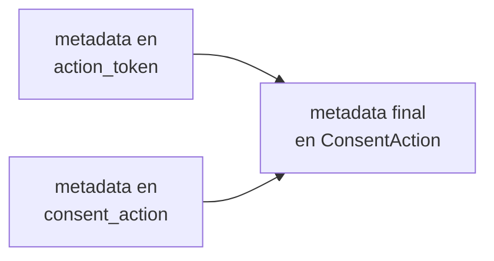

import Tabs from '@theme/Tabs';
import TabItem from '@theme/TabItem';

# Metadata en consentimientos

El campo `metadata` te permite asociar información contextual libre a cada acción de consentimiento. Es un objeto JSON con un tamaño máximo de 8 KB.

Úsalo para incluir datos de trazabilidad propios de tu sistema: identificadores de sesión, versiones de formulario, origen de campaña, etc.

:::warning[Evita información personal identificable (PII)]
No incluyas datos personales identificables (PII) como nombres, emails, teléfonos ni cualquier dato que identifique directamente a una persona. Usa identificadores internos o datos anonimizados.
:::

## Cuándo enviar metadata

Puedes enviar `metadata` en **dos momentos** del flujo. Soyio fusiona ambos objetos automáticamente en el `ConsentAction` resultante:



<Tabs>
    <TabItem value="api" label="Vía API" default>
        1. **Al crear el action token**: envía `metadata` en el body del request al endpoint `POST /api/v1/consent_templates/{id}/action_tokens`
        2. **Al crear el consent action**: envía `metadata` en el body del request al endpoint `POST /api/v1/consent_actions`
        3. Soyio fusiona ambos objetos. Si hay keys duplicadas, **la metadata del consent action tiene precedencia**
    </TabItem>
    <TabItem value="sdk" label="Vía SDK">
        1. **En las opciones del SDK** (`consentOptions`): pasa `metadata` en la configuración del componente
        2. **Al crear el consent action** (vía `POST /api/v1/consent_actions` desde tu backend): envía `metadata` en el body del request
        3. Soyio fusiona ambos objetos. Si hay keys duplicadas, **la metadata del consent action tiene precedencia**
    </TabItem>
</Tabs>

:::info[Tamaño máximo]
La metadata consolidada tiene un límite de 8 KB. Asegúrate de que la suma de ambos objetos no exceda este límite.
:::

## Metadata en un ConsentCommit

Si usas un [ConsentCommit](./consent-capture#opci%C3%B3n-2-crea-un-commit-de-varios-consentimientos-consentcommit) para registrar varios consentimientos en una sola llamada, puedes enviar `metadata` a nivel del commit:

```json title="POST /api/v1/consent_commits"
{
    "consent_actions": [
        { "action_token": "<token_1>" },
        { "action_token": "<token_2>" }
    ],
    "metadata": {
        "session_id": "sess_123456789",
        "form_id": "preferences_form_v2"
    }
}
```

La metadata del commit se fusiona con la metadata de cada action token individual y se aplica a todos los `ConsentAction` creados dentro del commit.

## Ejemplos por momento del flujo

### En la creación del action token

Consulta la referencia completa en [Crear un action token](../../api/resources/create-action-token.api.mdx).

```json title="POST /api/v1/consent_templates/{id}/action_tokens"
{
    "origin": "onboarding-producto-a",
    "kind": "grant",
    "channel": "digital",
    "timestamp": "2024-03-20T15:30:00Z",
    "metadata": {
        "session_id": "sess_123456789",
        "internal_user_id": "user_12345",
        "campaign_id": "campaign_abc123",
        "page_section": "newsletter_signup",
        "form_step": "step_2"
    },
    "contextual_data": {
        "ip": "192.168.1.100",
        "user_agent": "Mozilla/5.0 (Windows NT 10.0; Win64; x64) AppleWebKit/537.36",
        "url": "https://tu-sitio.com/consent"
    }
}
```

### En la creación del consent action

Consulta la referencia completa en [Crear un consent action](../../api/resources/create-consent-action.api.mdx).

```json title="POST /api/v1/consent_actions"
{
    "action_token": "<action_token>",
    "user_reference": "user_12345",
    "metadata": {
        "device_fingerprint": "fp_xyz789",
        "consent_version": "v1.2",
        "details": "El usuario otorgó consentimiento mediante checkbox en formulario de registro",
        "form_id": "registration_form_001",
        "campaign_source": "google_ads",
        "utm_campaign": "summer_promotion_2024",
        "user_flow_step": "registration_step_2"
    }
}
```

## Casos de uso comunes

Usa `metadata` para asociar información útil para la trazabilidad de tu negocio:

- Identificadores de sesión o flujo interno
- Identificadores de campaña o A/B test
- Versión del formulario de consentimiento
- Paso del flujo donde se capturó el consentimiento
- Origen del tráfico (UTM params)
