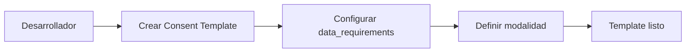
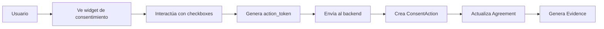
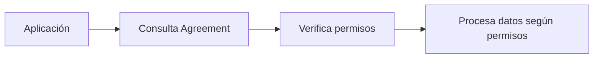
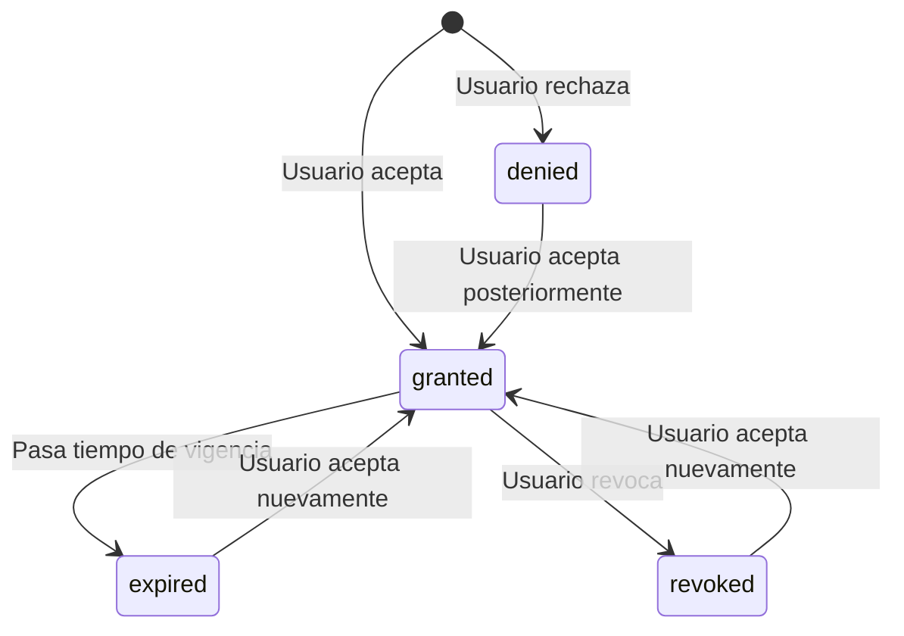

import SequenceDiagram from '../../../src/components/SequenceDiagram';

# Cómo funciona el consentimiento

El módulo de consentimiento de Soyio te permite obtener y gestionar el consentimiento de tus usuarios de manera transparente y conforme a las regulaciones de protección de datos. Te explicamos cómo funciona internamente y cuáles son las opciones disponibles.

## Modelo de datos de consentimiento

El sistema de consentimiento de Soyio se basa en un modelo de datos robusto que garantiza la trazabilidad y el cumplimiento normativo.

### Componentes principales


<br/>
<br/>

#### 1. Consent Template (Plantilla de Consentimiento)
La **plantilla de consentimiento** define la estructura y contenido de la solicitud de consentimiento:

```json
{
  "id": "constpl_wAspvmEr4ACDZaPUtfwjsA",
  "name": "Marketing Básico",
  "title": "Quiero recibir ofertas y promociones",
  "text": "Acepto el tratamiento de mis datos para fines de marketing...",
  "duration": "P2Y",
  "data_requirements": [
    {
      "key": "email",
      "data_category": "contact.email",
      "data_uses": ["marketing.communications"]
    }
  ]
}
```

#### 2. Action Token (Token de Acción)
Cada interacción del usuario genera un **token de acción** que representa una decisión específica:

```json
{
  "action_token": "act_abc123...",
  "template_id": "constpl_wAspvmEr4ACDZaPUtfwjsA",
  "user_identity_id": "user_xyz789...",
  "timestamp": "2024-03-20T15:30:00Z"
}
```

#### 3. Consent Action (Acción de Consentimiento)
El **registro de consentimiento** que se crea cuando el usuario otorga su consentimiento:

```json
{
  "id": "consent_abc123...",
  "action_token": "act_abc123...",
  "template_id": "constpl_wAspvmEr4ACDZaPUtfwjsA",
  "user_identity_id": "user_xyz789...",
  "status": "granted",
  "granted_at": "2024-03-20T15:30:00Z",
  "evidence": "evid_xyz789..."
}
```

#### 4. Agreement (Acuerdo)
El **acuerdo** es la fuente de verdad que determina qué permisos tiene un usuario:

```json
{
  "id": "agr_abc123...",
  "user_identity_id": "user_xyz789...",
  "permissions": [
    {
      "data_category": "contact.email",
      "data_uses": ["marketing.communications"],
      "status": "granted",
      "granted_at": "2024-03-20T15:30:00Z",
      "expires_at": "2026-03-20T15:30:00Z"
    }
  ],
  "last_updated": "2024-03-20T15:30:00Z"
}
```

#### 5. Evidence (Evidencia)
La **evidencia** es una prueba criptográfica inmutable del consentimiento otorgado:

```json
{
  "id": "evid_xyz789...",
  "consent_action_id": "consent_abc123...",
  "template_version": 1,
  "cryptographic_proof": "sha256:abc123...",
  "timestamp": "2024-03-20T15:30:00Z",
  "metadata": {
    "ip_address": "192.168.1.1",
    "user_agent": "Mozilla/5.0...",
    "template_snapshot": {...}
  }
}
```

## Flujo de datos

### 1. Creación de la plantilla


### 2. Captura del consentimiento


### 3. Verificación de permisos


## Integración con SDK Web

### Flujo básico

<SequenceDiagram
  actors={[
    { id: 'frontend', label: 'Tu Frontend' },
    { id: 'backend', label: 'Tu Backend' },
    { id: 'consent_widget', label: 'Consent Widget' },
    { id: 'soyio_api', label: 'Soyio API' },
  ]}
  actions={[
    {
      from: 'frontend',
      to: 'consent_widget',
      label: 'Inicializar con template_id'
    },
    {
      from: 'consent_widget',
      to: 'frontend',
      label: 'Usuario interactúa con checkboxes'
    },
    {
      from: 'consent_widget',
      to: 'frontend',
      label: 'Genera action_token',
      isDashed: true
    },
    {
      from: 'frontend',
      to: 'backend',
      label: 'Envía action_token'
    },
    {
      from: 'backend',
      to: 'soyio_api',
      label: 'Crea ConsentAction'
    },
    {
      from: 'soyio_api',
      to: 'backend',
      label: 'Retorna ConsentAction creado'
    },
    {
      from: 'backend',
      to: 'soyio_api',
      label: 'Consulta Agreement actualizado',
      isDashed: true
    },
    {
      from: 'soyio_api',
      to: 'backend',
      label: 'Retorna permisos actualizados',
      isDashed: true
    }
  ]}
/>

### Flujo con Consent Commit

<SequenceDiagram
  actors={[
    { id: 'frontend', label: 'Tu Frontend' },
    { id: 'backend', label: 'Tu Backend' },
    { id: 'soyio_api', label: 'Soyio API' },
  ]}
  actions={[
    {
      from: 'frontend',
      to: 'frontend',
      label: 'Usuario interactúa con múltiples checkboxes'
    },
    {
      from: 'frontend',
      to: 'frontend',
      label: 'Recopila múltiples action_tokens'
    },
    {
      from: 'frontend',
      to: 'backend',
      label: 'Envía array de action_tokens'
    },
    {
      from: 'backend',
      to: 'soyio_api',
      label: 'Crea Consent Commit con action_tokens'
    },
    {
      from: 'soyio_api',
      to: 'backend',
      label: 'Retorna ConsentCommit y ConsentActions'
    },
    {
      from: 'backend',
      to: 'frontend',
      label: 'Confirma registro de consentimientos'
    }
  ]}
/>

## Integración vía API

### Flujo directo

<SequenceDiagram
  actors={[
    { id: 'frontend', label: 'Tu Frontend' },
    { id: 'backend', label: 'Tu Backend' },
    { id: 'soyio_api', label: 'Soyio API' },
  ]}
  actions={[
    {
      from: 'frontend',
      to: 'backend',
      label: 'Usuario otorga consentimiento'
    },
    {
      from: 'backend',
      to: 'soyio_api',
      label: 'Crea ConsentAction directamente'
    },
    {
      from: 'soyio_api',
      to: 'backend',
      label: 'Retorna ConsentAction creado'
    },
    {
      from: 'backend',
      to: 'soyio_api',
      label: 'Consulta Agreement actualizado',
      isDashed: true
    },
    {
      from: 'soyio_api',
      to: 'backend',
      label: 'Retorna permisos actualizados',
      isDashed: true
    }
  ]}
/>

## Estados del consentimiento

### Estados principales

| Estado | Descripción | Cuándo ocurre |
|--------|-------------|---------------|
| `granted` | Consentimiento otorgado | Usuario acepta explícitamente |
| `denied` | Consentimiento denegado | Usuario rechaza explícitamente |
| `expired` | Consentimiento expirado | Ha pasado el período de vigencia |
| `revoked` | Consentimiento revocado | Usuario revoca su consentimiento |

### Transiciones de estado



## Verificación de permisos

### Consulta del Agreement

```javascript
// Verificar si el usuario puede usar email para marketing
const checkPermission = async (userId, dataCategory, dataUse) => {
  const response = await fetch(`https://api.soyio.com/v1/agreements/${userId}`, {
    headers: {
      'Authorization': `Bearer ${process.env.SOYIO_API_KEY}`
    }
  });
  
  const agreement = await response.json();
  
  return agreement.permissions.some(permission => 
    permission.data_category === dataCategory &&
    permission.data_uses.includes(dataUse) &&
    permission.status === 'granted' &&
    new Date(permission.expires_at) > new Date()
  );
};
```

### Consulta del Compliance Status

```javascript
// Verificar estado de cumplimiento
const checkCompliance = async (userId) => {
  const response = await fetch(`https://api.soyio.com/v1/compliance_status/${userId}`, {
    headers: {
      'Authorization': `Bearer ${process.env.SOYIO_API_KEY}`
    }
  });
  
  const compliance = await response.json();
  return compliance;
};
```

## Trazabilidad y auditoría

### Evidencia inmutable

Cada consentimiento genera evidencia criptográfica que incluye:

- **Hash del template** utilizado
- **Timestamp** exacto del consentimiento
- **Metadatos** del usuario (IP, User-Agent)
- **Snapshot** del template en ese momento
- **Prueba criptográfica** del proceso completo

### Versionado de templates

- Cada modificación del template crea una nueva versión
- La evidencia siempre referencia la versión exacta utilizada
- Historial completo de cambios auditable
- Trazabilidad completa del ciclo de vida

## Mejores prácticas

### ✅ Recomendaciones

- **Consulta siempre el Agreement** antes de procesar datos
- **Maneja todos los estados** del consentimiento
- **Implementa revocación** fácil para el usuario
- **Usa evidencia** para auditorías y cumplimiento
- **Mantén templates actualizados** según cambios normativos

### ❌ Evitar

- **Asumir permisos** sin verificar el Agreement
- **Ignorar estados** de consentimiento expirado/revocado
- **Procesar datos** sin consentimiento válido
- **Modificar templates** sin considerar versionado
- **Omitir evidencia** en procesos críticos

## Próximos pasos

- [Quickstart](./quickstart) - Implementa consentimiento paso a paso
- [Plantillas de consentimiento](./consent-templates) - Configura tus templates
- [Consent Commit](./consent-commit) - Agrupa múltiples consentimientos
- [Taxonomía](../main/taxonomy) - Entiende las categorías de datos

## Recursos adicionales

- [API Reference: Consent Actions](../../api/resources/create-consent-action.api.mdx)
- [API Reference: Agreements](../../api/resources/schemas/agreement)
- [API Reference: Evidence](../../api/resources/schemas/evidence)
- [Esquema: ConsentAction](../../api/resources/schemas/consentaction)